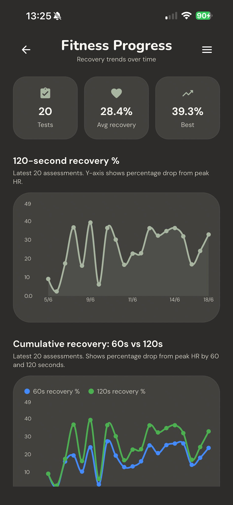
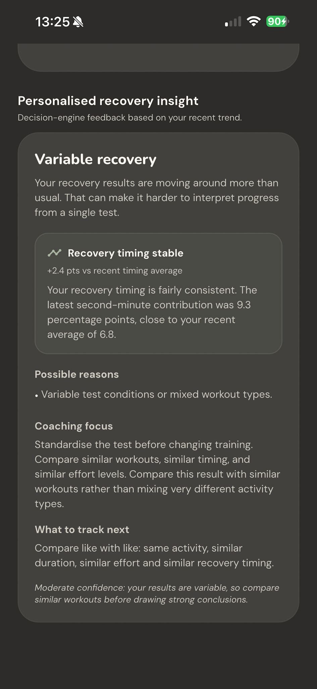

# Pulse Recovery Overview

## What does the Pulse Recovery App do
Pulse Recovery helps users answer a simple but important question after exercise: how well did I recover, and what should I do next?

Using smartwatch heart-rate data, subjective feedback, session history, and recovery trends over time, the app turns each workout into clear, personalised recovery guidance. It interprets the latest session, explains what appears to be driving the result, compares it with previous recovery patterns, and gives practical advice on how to approach the next workout.

Pulse Recovery helps users answer a simple but important question after exercise: *how well did I recover, and what should I do next?*

## More Than a Heart-Rate Chart

Many apps and devices can record heart-rate data. Pulse Recovery is not trying to replace that. Its purpose is to turn recovery data into something more understandable and actionable.

A user may already be able to see their heart rate, workout zones, recovery curve, or historical health data. The harder question is what those numbers mean in the context of a specific workout, how the user felt, and whether their recovery pattern is improving or showing signs of strain.

Pulse Recovery is designed to close that gap. It combines objective recovery data with subjective feedback and previous results, then explains both the latest session and the longer-term trend. The value is not just in capturing the data, but in helping the user understand what the data may suggest and what they might do next.

## The Idea

The genesis of this app dates back to last summer in Austria, where I would go for runs and wonder how fit I really was. I started measuring my heart rate immediately after stopping, then again after two minutes, to see how well it recovered. I would then enter the results into ChatGPT and ask what they might say about my fitness.

A year later, I was talking with a friend about her idea for an app that would help people, especially beginners, stay engaged in sport by providing dynamic, personalised feedback and encouragement. That conversation made me think again about my summer runs, and how useful it would be to create something simple for people who ask the same kinds of questions: *Am I getting fitter? Am I recovering well? Was that session harder than it should have been?*

That led me to research the physiology of heart-rate recovery and how it could be used not just to assess a single workout, but to help users understand their fitness and recovery patterns over time. I also wanted the app to feel more personal, so I added subjective measures such as perceived effort and how the user felt after exercise. By combining these with previous results, the app could begin to identify trends rather than simply report isolated scores.

The next challenge was translating this information into useful and actionable advice. An obvious option would have been to replicate what I had done manually the previous summer and pass the results to an AI agent. For the first iteration of the product, I chose not to do that. Instead, I built a rule-based decision engine.  AI may well be integrated into future versions of the app, particularly when generating summaries and trend information.

## The User Experience

The original version of the idea was completely manual. I would finish a run, check my heart rate, wait two minutes, check it again, and then try to interpret what the drop meant. That worked as a personal experiment, but it was not something most people would want to do regularly. It relied on remembering to take the measurements, recording the numbers accurately, and then finding some way to make sense of them afterwards.

The obvious next step was to use the device many active people already have on their wrist. A smartwatch is well suited to this kind of problem because it can capture heart-rate data continuously during exercise and recovery, without the user having to stop and manually record values. Instead of asking the user to remember numbers, the watch can become the capture device.

In the Pulse Recovery experience, the watch is used to record the heart-rate session. The user starts a recovery assessment around their workout, and the watch captures the heart-rate curve across the exercise and recovery period. This creates a much richer picture than my original two-point measurement, because the app can now see the whole pattern: the build-up during activity, the peak heart rate, the first-minute recovery and the shape of the recovery curve.  This also allowed use of more fine grained input values, such as the first and second minute post workout recovery heart rate.

The phone app then becomes the place where the user reviews and understands the result. The watch captures the data; the phone presents the insight. Once the session is synced, the user can see the heart-rate curve, the calculated recovery values, enter the subjective inputs, and get the final recommendation. The aim is not just to show numbers, but to translate them into a simple message: whether to progress, maintain, use caution, or prioritise recovery.

This watch-and-phone split is important to the product design. The watch should be quick and low-friction, because it is used during and immediately after exercise. The phone can provide the richer experience: charts, history, trend analysis, explanations, and comparisons with previous sessions. Over time, this allows the app to move beyond a single recovery score and start answering more useful questions, such as whether recovery is improving, whether a session created unexpected strain, or whether the user is handling their current training load well.

In this way, Pulse Recovery evolved from a manual heart-rate check into a connected recovery workflow: capture on the watch, sync to the phone, interpret through an explainable decision engine, and track progress over time.

## From Watch Capture to Recovery Advice

Pulse Recovery is designed around a simple workflow: capture the heart-rate session on the watch, sync it to the phone, interpret the recovery data, and turn it into practical advice.

The watch is used where low friction matters most: during and immediately after exercise. The phone is used where a richer experience is useful: reviewing the session, adding subjective context, seeing trends, and understanding the recommendation.

<table>
  <tr>
    <td colspan="2" align="center" valign="top">
        
      <strong>1. Capture on the watch</strong> 
      <em>The watch provides a low-friction way to capture heart-rate data during exercise and recovery. The user starts the session at the beginning of the workout and stops it when the workout ends. The app then records the recovery period automatically, including heart-rate samples at the end of exercise, after 60 seconds, and after 120 seconds.</em>
    </td>
  </tr>

  <tr>
    <td width="50%" align="center" valign="top">
        
      <strong>2. Review the session curve</strong> 
      <em>Once the data is synced to the phone, the session view shows the full workout and recovery curve. This gives a richer picture than a simple two-point measurement, because the app can show peak heart rate, first-minute recovery, second-minute recovery, and the shape of the recovery curve.</em>
    </td>

<td width="50%" align="center" valign="top">
    
  <strong>3. Get single-session advice</strong> 
  <em>The app combines the captured heart-rate data with subjective inputs, such as perceived effort and how the user felt after exercise. The decision engine then produces a simple recommendation for that session: progress, maintain, use caution, or prioritise recovery.</em>
</td>

  </tr>

  <tr>
    <td width="50%" align="center" valign="top">
        
      <strong>4. Track recovery over time</strong> 
      <em>The trends screen helps users see how their recovery is changing across multiple sessions. This is important because a single recovery score can be useful, but the pattern over time is often more meaningful.</em>
    </td>

<td width="50%" align="center" valign="top">
    
  <strong>5. Get trend-based advice</strong> 
  <em>Trend advice adds the longer-term context. For example, improving recovery may suggest better fitness or adaptation, while worsening recovery combined with high effort or poor post-exercise feeling may suggest accumulated fatigue or the need for an easier session.</em>
</td>

  </tr>
</table>

The important point is that Pulse Recovery does not simply collect heart-rate data. It turns that data into advice at two levels: immediate advice about the latest session, and trend advice based on how recovery is changing over time.

## How the Advice Works

Pulse Recovery does not treat heart-rate recovery as a single isolated number. The app combines objective recovery data, subjective user feedback, and previous session history to produce advice that is specific to the latest workout and meaningful in the context of longer-term trends.

For each session, the app looks at the heart-rate response during exercise and recovery. This includes the peak heart rate reached during the workout, the heart rate at the end of exercise, the drop after 60 seconds, the drop after 120 seconds, and the overall shape of the recovery curve. These values help describe how hard the session was and how quickly the body began to recover afterwards.

The app then adds subjective context. Two workouts can produce similar heart-rate numbers but feel very different to the person doing them. A session that produced a normal recovery response but felt unusually hard may need to be interpreted differently from one that felt comfortable. For this reason, Pulse Recovery includes user inputs such as perceived effort and how the user felt after exercise.

The advice engine combines these inputs with previous results. This allows the app to look beyond a single session and ask whether recovery appears to be improving, stable, or deteriorating over time. A single lower recovery score may not matter much on its own, but a pattern of declining recovery, higher perceived effort, or poorer post-exercise feeling may suggest that the user is accumulating fatigue or not recovering as well as usual.

The output is advice at two levels. First, the app gives guidance for the latest session, explaining what the recovery response appears to suggest and how the user might approach their next workout. Second, it provides trend advice, highlighting whether the user’s recovery pattern is moving in a positive, stable, or concerning direction.

The goal is not simply to label a workout as good or bad. The goal is to help the user understand what the session may mean, what appears to be driving the advice, and whether their recovery pattern suggests that they can push on, hold steady, reduce intensity, or allow more time to recover.

## Why a Rule-Based Decision Engine?

An obvious way to generate recovery advice would be to pass the session data to an AI model and ask it to produce an interpretation. That was close to how the original personal experiment worked: I would record my heart-rate recovery values and ask ChatGPT what they might mean.

For the first version of Pulse Recovery, I deliberately chose a different approach. The core recovery judgement is produced by a rule-based decision engine rather than a generative AI model.

The reason is that recovery advice needs to be transparent, consistent, and controllable. If the app recommends that a user should progress, maintain their current level, use caution, or prioritise recovery, it should be possible to understand why. The recommendation should be traceable to the heart-rate recovery values, the subjective inputs, the user’s previous results, and the trend conditions that triggered it.

A rule-based engine also makes the product easier to test and improve. Thresholds can be tuned, wording can be adjusted, and edge cases can be handled deliberately. If a user receives advice that does not feel right, the logic can be reviewed and refined rather than hidden inside a black-box response.

This does not mean AI has no role. In future, AI could be useful as a coaching-language layer: helping explain the advice in a warmer, more personalised, and more conversational way. It could also help summarise longer-term patterns or adapt the tone of the guidance to different kinds of users.

However, the core recovery decision should remain explainable. Pulse Recovery is designed so that the advice is not just persuasive, but accountable: the app should be able to show what it considered, why it reached its conclusion, and how the user’s latest session fits into their broader recovery pattern.

## What Makes Pulse Recovery Different?

Many fitness apps collect heart-rate data, but the data is often left for the user to interpret. A user may be able to see their peak heart rate, average heart rate, or workout zones, but still be left wondering what the session actually means for their fitness, recovery, or next workout.

Pulse Recovery is designed to close that gap between data and understanding.

The app does not simply display heart-rate numbers or produce a generic recovery score. It combines the objective recovery response from the workout with subjective feedback from the user and the pattern of previous sessions. This makes the advice more personal and more useful than a single isolated measurement.

The distinction is important. A fast heart-rate drop after exercise may suggest good recovery, but it means more when considered alongside how hard the session felt, how the user felt afterwards, whether similar sessions have produced better or worse recovery in the past, and whether the overall trend is improving or declining.

Pulse Recovery therefore provides advice at both a session level and a trend level. It can help the user understand the latest workout, but also whether their recovery pattern appears to be improving, stable, or showing signs of strain.

The aim is to make recovery data actionable. Instead of asking the user to interpret charts and numbers on their own, Pulse Recovery explains what the data may suggest and helps them make a more informed decision about how to approach their next session.

## Future Direction

Pulse Recovery is currently focused on turning heart-rate recovery data into clear, explainable advice at both a session and trend level. The next stage is to make that advice more personalised, more useful over time, and easier for different kinds of users to act on.

One important direction is the development of stronger personal baselines. Heart-rate recovery varies between individuals, and the same result may mean different things depending on the user’s age, fitness level, workout type, recent history, and normal recovery pattern. As more sessions are collected, the app can become better at recognising what is normal for that user and identifying when a session looks unusually strong, unusually hard, or potentially affected by fatigue.

Another area is richer trend analysis. The app already looks beyond a single session, but there is scope to provide more detailed insight into how recovery is changing over time. This could include clearer explanations of improving, stable, or declining recovery patterns, as well as better visualisation of changes in recovery rate, perceived effort, and post-exercise feeling.

The advice itself can also become more adaptive. Different users may need different kinds of guidance: a beginner may need reassurance and encouragement, while a more experienced athlete may want more detail about training load, intensity, and recovery quality. Future versions could tailor the tone and depth of explanation while keeping the underlying decision logic transparent.

AI may have a role in this future development, but not as a replacement for the core decision engine. A useful direction would be to use AI as a coaching-language layer that explains the results in a warmer, more conversational, and more personalised way. The underlying recovery judgement should remain explainable and grounded in the user’s data.

There is also scope to extend the product beyond a single watch and phone workflow. Future versions could support additional devices, richer workout-type classification, saved and shareable charts, and more detailed history views. Over time, Pulse Recovery could become not just a recovery assessment tool, but a personal recovery companion that helps users understand how their body is responding to training.

## Summary

Pulse Recovery began with a simple personal question after exercise: *how well did I recover, and what does that say about my fitness?*

The app turns that question into a connected workflow: capture heart-rate data on the watch, review the session on the phone, add subjective context, interpret the result through an explainable decision engine, and track recovery patterns over time.

Its value is not simply in recording heart-rate data. Many devices already do that. The value is in helping users understand what their recovery data may mean, how their latest session compares with previous results, and how they might approach their next workout.

Pulse Recovery is designed to make recovery insight more accessible, more personal, and more actionable. It gives users a clearer view of whether they appear to be adapting well, holding steady, accumulating fatigue, or needing more time to recover.

