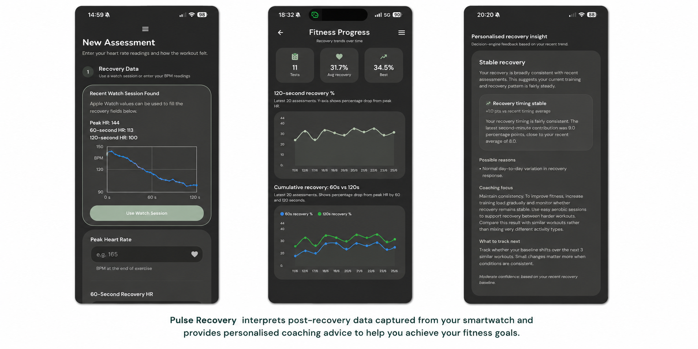
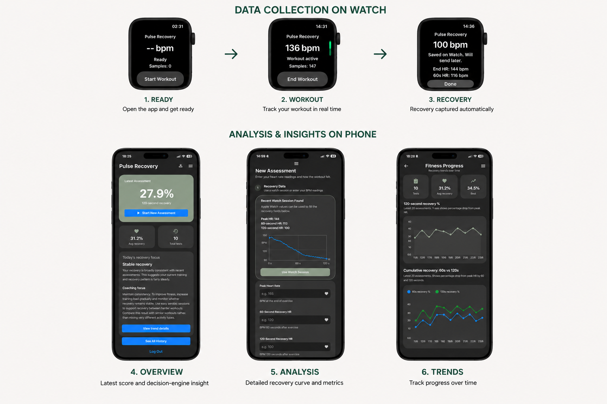

# The Biggest Challenge Wasn't Building The App

#### What happened when I used AI as my development team to build a recovery coaching application.

## I Thought Coding Would Be The Bottleneck

Pulse Recovery is a smartwatch-based recovery coaching application that helps users understand how well they recover from exercise and what actions may improve their recovery over time.  Unlike most fitness applications, which focus on recording activity, Pulse Recovery focuses on interpreting post-exercise recovery and translating physiological data into actionable coaching guidance. Although the project began as an experiment, it evolved into a multi-platform product, implemented on both iOS and Android, spanning smartwatch applications, mobile applications, cloud services, analytics, authentication, and a rules-based coaching engine.

I originally conceived the project as an exploration of post-exercise heart-rate recovery, based on my own attempts to estimate my fitness. It also became an unexpected experiment in AI-assisted product development. Drawing on my experience in product management, analytics, and software development, I used AI as the primary implementation resource while assuming the roles of product strategist, product manager, domain expert, and development manager.

The result surprised me. As I expected, AI dramatically accelerated software implementation, but the hardest challenges were not technical. The real work involved deciding what should be built, determining how success should be measured, and using faster implementation cycles to learn, revise, and refine the product as it evolved.  For example, taking the raw watch input and deciding how to transform this into actionable advice led me to experiment with different decision models and ways in which to expose the output to the user.

The experience left me with a simple conclusion: AI changes the economics of building software, but it does not remove the need for product thinking. If anything, it increases the leverage of people who can combine domain expertise, product judgement, and rapid experimentation.

The project also reinforced another lesson from my software industry experience: AI can generate code quickly, but it does not automatically make good architectural decisions. Throughout the project I had to challenge implementation choices, separate decision logic from user-interface code, and remain mindful of maintainability. Without that oversight, rapid AI-assisted development could easily have produced technical debt just as quickly as it produced features.

## AI Can Write Code. That Wasn't The Interesting Part

Much of the current discussion around AI focuses on code generation, developer productivity, and whether software engineers will be replaced. Or variants on how anyone can build an app in a day and so on.  Whether AI can assist or generate working code from scratch is pretty much settled. It can. A much more interesting question is not what AI can do, but:

#### What can a product-oriented individual do when access to implementation is no longer the primary constraint?

Historically, turning an idea into a working product required coordinating specialists across product management, design, software engineering, analytics, and operations. I found that AI does not eliminate those disciplines, but it dramatically reduces the effort required to move from concept to prototype. For me, Pulse Recovery then became an experiment in what happens when one person can rapidly test product hypotheses that would previously have required a team.

## The Real Question Was What To Build

As expected, AI proved remarkably capable of implementing ideas.  Over a short period of time I was able to build components spanning smartwatch applications, mobile applications, cloud storage, analytics, visualisations, authentication, and coaching logic. In previous roles, many of these tasks would have required specialist developers and significant coordination effort.  The results were impressive: once I could 'pass on' the actual development I could focus on getting the user workflow right and figuring out how to best architect the solution.

The application evolved into a complete workflow spanning workout capture on a smartwatch, recovery analysis on a phone, longitudinal trend tracking, and personalised coaching guidance. What surprised me was how rarely implementation became the bottleneck.  Because of this I was able to spend much more time on the important 'business' questions:

- Which recovery metrics actually matter?
- How should recovery be measured?
- What constitutes meaningful improvement?
- How long should a user follow an intervention before reassessment?
- How should coaching advice be generated?
- How should progress be visualised?

## Building The Product Was Easier Than Defining It

These were not coding problems. They were product, domain, and research problems. In many cases AI could build a feature within minutes. Determining whether the feature should exist and how it should be exposed to the user often took days of investigation and experimentation.

The project evolved through repeated cycles of hypothesis, implementation, observation, and refinement. Many of the most important requirements were discovered rather than specified. Decisions only emerged after seeing real outputs, reviewing data, questioning assumptions, and researching exercise physiology.  The challenge was not getting AI to implement a predefined solution.  The challenge was discovering what the solution should be.

## AI Reduced The Cost Of Experimentation

The distinction between building software and building the right software is not new. Product teams have always faced the risk of solving the wrong problem or prioritising the wrong features. Many projects fail despite being well engineered.  What AI changes is the economics of experimentation.

Ideas that previously required a team can now be prototyped by a single individual. Experiments that once took weeks can be performed in hours. This dramatically increases the leverage of product-oriented people and shortens the feedback loop between idea and learning.  However, reducing the cost of implementation does not reduce the need for judgement.  Someone still has to determine:

- Which problems are worth solving
- Which experiments are worth running
- Which trade-offs matter
- How success should be measured
- What should happen next

## Judgement Became More Important, Not Less

The project also reinforced another lesson from my software industry experience: AI can generate code quickly, but it does not automatically make good architectural decisions. Throughout the project I had to challenge implementation choices, separate decision logic from user-interface code, and remain mindful of maintainability. Without that oversight, rapid AI-assisted development could easily have produced technical debt just as quickly as it produced features.  Those responsibilities remain fundamentally human.

## The Biggest Challenge Wasn't Building The App

Before starting Pulse Recovery, I assumed software development would be the primary constraint.  Instead, AI made implementation the easiest part of the process.

The bottleneck shifted to understanding the problem, interpreting the results, and deciding what to do next. It also became clear that AI-generated code still needs direction. Left unchecked, AI can implement features in ways that work locally but create architectural problems later. Separating decision logic from the user interface, keeping the code maintainable, and challenging implementation choices remained important human responsibilities.

That may ultimately be the most important lesson I learned.  AI did not replace product management or technical judgement. It reduced the cost of implementation so dramatically that product judgement, domain expertise, and architectural discipline became more visible. The biggest challenge wasn't building the app. It was deciding what the app should become — and ensuring that it was built in a way that could continue to evolve.

## About Pulse Recovery

Pulse Recovery remains an evolving project rather than a commercial product. My goal was not to build a fitness business, but to explore both the recovery coaching concept and the practical implications of AI-assisted product development.

The iOS version is currently available for testing through Apple's App Store Connect and TestFlight. If you have an Apple Watch and iPhone and would like to try it, feel free to drop me a message.
